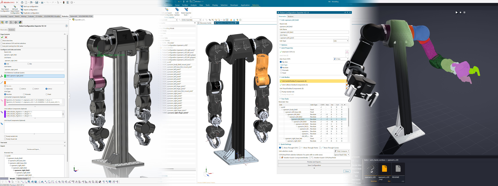

# SuperDex CAD Exporter

SuperDex CAD Exporter is a heavily-modified fork of the original [Solidworks to URDF Exporter](https://github.com/ros/solidworks_urdf_exporter), primarily designed for exporting robots from both **Siemens NX** and **SolidWorks** for import into SuperDex Studio, but supports robotic definition formats .urdf and .mjcf as well.

## Features at a glance

The plugins for both NX and SolidWorks have near-parity to each other in terms of features and the following differences from the original:

- Exports .superdex_bot, .urdf, and .mjcf
- Assemblies are supported (SolidWorks), Parts and Assemblies are supported (NX)
- Supports GLB, OBJ and STL export tessellated using superdex_mesh_cli under the hood
- Supports STEP file export for tessellation to meshes using SuperDex Studio
- Mesh and STEP formats are exported in the correct coordinate frame for each Link
- Link reference Coordinate Systems and Axes can be defined at any level in the assembly (can be nested in parts, subassemblies or at the top level)
- Automatic Link and Joint numbering when defining the kinematic tree
- Coordinate System and Axis selections are similar to standard SolidWorks/NX selections (select from Feature Tree or click from the graphical viewport)
- Significant UI/UX improvements to selection system for defining links and joints
- Significant UI/UX improvements to export window along with joint limit visualization, inertia box visualization, center of mass, and summary tabs
- Experimental support for tendons
- Uses negative tensor notation for the exporting inertial properties, regardless of SolidWorks/NX settings, along with the correct coordinate system.

Some notable features that have been removed, amongst others:

- Tree merge functionality for links
- Automatic joint creation from assembly constraints

## Development setup

- Windows 11
- Visual Studio 2022 with .NET Desktop Development
- CMake (for building superdex_mesh_cli)
- A SolidWorks API installation is required for SolidWorks
- The .NET SDK is required to build the SolidWorks installer (the WiX v6 toolset is restored automatically via NuGet)
- An NXOpen license is required for Siemens NX

## Building

1. Build superdex_mesh_cli.exe and place the binary in `/src/Meshing/superdex_mesh_cli.exe`
2. (For SolidWorks) Launch Visual Studio 2022 as administrator (Right-click -> Run as administrator)
3. Open SuperDexCADExporter.sln
4. For SolidWorks, right-click on SolidWorksRobotExporter and click Build. The Add-In should be registered automatically. If not, or the build is failing, double-check the SolidWorks API locations in SolidWorksRobotExporter.csproj and update accordingly.
5. For NX, right-click on NXRobotExporter and click Build. The built files by default are deposited into `C:/NXCustom/`. Please see below for installation instructions.
6. For SolidWorks, run `scripts/MakeSolidWorksInstaller.ps1` via Powershell to build the installer. The MSI will be written to `installer/OUTPUT/SuperDexCadExporterSetup.msi`.

## Installation

### SolidWorks

1. Download the installer from the latest release on the [Release page](https://github.com/facebookresearch/project_superdex/releases).
2. Make sure SolidWorks is closed before starting.
3. If you have the original SolidWorks to URDF Exporter installed, please uninstall it first. (Add or remove programs → SolidWorks To URDF)
4. Run the installer and go through the prompts.
5. After installation, the next time you launch SolidWorks and open an Assembly, there should now be a **Robotics** tab in your ribbon bar.
   - If not, go to Tools → Add-ins..., then tick 'SuperDex CAD Exporter' at the bottom, along with 'Start Up'. Then **close and restart** SolidWorks.

### Siemens NX

1. As we currently do not distribute binaries for the NX plugin, please follow the building instructions shown in the [README](https://github.com/facebookresearch/project_superdex/blob/main/superdex_studio/superdex_cad_exporter/README.md).
2. Make sure Siemens NX or Teamcenter NX is closed before starting
3. The build process should deposit `application` and `startup` folders into `C:/NXCustom`.
4. Add `UGII_USER_DIR` to your User or System Environment Variables (System Properties → Environment Variables...) and point it to `C:/NXCustom`.
5. The next time you launch Siemens NX or Teamcenter NX, there should now be a Robotics tab in your ribbon bar. If not, reboot your PC and try again.

## Usage

Please refer to the [documentation](http://facebookresearch.github.io/project_superdex/studio/docs/cad_exporter) for a full tutorial and additional information about advanced features.

### Quickstart

1. Open your robot's top-level Assembly (SolidWorks) or Assembly/Part (NX)
2. Every Joint/Link origin must have a Coodinate System, which can be in any level of the assembly (in individual parts/components or in the assembly itself)
3. For any Joint Axis that is not colinear with the Link's Coodinate System's primary axes (±X, ±Y, ±Z), add an Axis (Datum Axis for NX) for every prismatic or revolute joint. This axis can also be in any level of the assembly.
4. Create a new Robot Configuration from the Robotics tab.
5. Right click the base_link and click Add Link for each link in your kinematic chain (links can have multiple children), or use the Tree Tools to construct serial chains or import trees from plain text.
6. For the base/world link, select your global/world Coordinate System, and the parts or assemblies that represent the Inertial, Collision and Visuals (all optional) of the link.
7. For each kinematic link, select a Joint Type, Coordinate System, the parts or assemblies that represent the Inertial, Collision and Visuals (all optional) of the link. Then select either the Coordinate System's axes representing the joint axes or an Axis/Datum Axis.
8. If needed, save your progress and close the exporter to work on the assembly by clicking on the checkmark above (SolidWorks) or use the Save Configuration button (NX).
9. Once you're ready, click the Preview and Export button
10. Wait for temporary features to be created for calculating Link/Joint frames.
11. Optionally configure Joint Properties, Link Properties or view the Kinematics Summary or Tendons Summary.
12. Configure the meshing options and export the robot from the Link Properties tab. Click on the Export Robot and Meshes button to begin the export and meshing process.
13. The exported .superdex_bot can be readily copied into SuperDex Studio's workspace for further processing and simulation. It is highly recommended to export **Collision meshes as STEP files** for meshing in SuperDex Studio. **Visual meshes** should be exported as **.glb** for SuperDex Studio. *All other simulation platforms may not have full compatibility for other mesh formats.*

## Full feature list

### Both platforms

- Supports both **Siemens NX** (Parts & Assemblies) and **SolidWorks** (Assemblies)
- Exports robot to **.superdex\_bot, .urdf**, and **mjcf .xml**
- **Robotics ribbon tab** for ease of accessing features
- **Multiple robot configurations** per assembly, stored as features
- Duplicate, import, and back-up robot configurations across assemblies and CAD software
- Link mesh formats: **.glb**, **.obj**, **.stl** and STEP (for external tessellation) exported at each links’ coordinate frame
- Separated visual/collision mesh format extension settings (e.g. visual set to .glb, collision set to .stl)
- Export multiple mesh formats simultaneously
- **superdex\_mesh\_cli** meshing backend with configurable parameters for .glb/.obj/.stl
- Per-link meshing options
- Direct from part or assembly superdex\_mesh\_cli export
- **Single-Link mesh export** (no need to export the whole robot for iterating on geometry)
- **User-saveable and shareable mesh export presets**
- **Sites** support (lightweight links with no children or bodies; exported as sites in mjcf, fixed joints for SuperDex/.urdf)
- **Tendons** support (experimental, primarily for SuperDex Robotics)
- **Native selection system** for both SolidWorks and NX
- Select link components/bodies as **separate Inertial, Visual and Collision geometry** (or no geometry at all)
- Link reference Coordinate Systems and Axes can be defined **at any assembly level** (nested parts, subassemblies, or top-level)
- Joint axes specifiable as **Coordinate System axes** (no Datum Axes required)
- **Joint Axis/Limit visualization**
- **Inertia & Center of Mass visualization**
- **Tendon routing visualization**
- Flip joint axes easily using a checkbox
- Joint angles editable in both **degrees and radians**
- Automatic Joint naming
- Automatic Link naming/numbering
- **Kinematics Summary** tab, view entire tree's link/joint properties at a glance in a table
- **Tendons Summary** tab with table view
- Tree Tools: create N-dof serial chains, insert parent/child links, import/export kinematic trees as **plaintext files**
- **URDF Import**: imports URDF as CSYS/Datum Axes with auto-created Robot Configuration with configurable world/base coordinate system
- **Persistent references** parts/bodies/coordinate systems/axes saved by persistent IDs (survives renames)
- **Robot name** field for distinguishing between configurations
- Timestamped configuration backups saved alongside robot export package
- **Progress bar window** for long-running processes (coordinate system calculation, mesh export)
- **Auto advance** selection mode for rapidly building new robot configurations
- Tooltips and hints
- Save location remembered between sessions
- Show folder after export
- Robust handling of **partially-loaded assemblies**
- Negative tensor notation for inertial properties with correct coordinate system, regardless of user settings
- Unix-linebreaks and single-line xml attributes
- Lossless **floating-point precision** (\~15 decimal places) for exported values
- Mass/inertia properties respects **overridden masses**

### NX-specific

- **NX-native export dialog with familiar selection controls**
- NX-native .glb, .obj and .stl mesh export
- **Quick Settings** flyout: Show Through CSYS/Points/Curves, Link Selection Mode, read-only selection behavior, Deselect Guards
- Tree editing tools: Add Site, Add Sibling Link, Convert to Root Link, Add New Root Link
- Multi-select links in tree (Ctrl/Shift) for batch joint property editing
- URDF Import can optionally import meshes as **Convergent Bodies** (.obj/.stl only)
- **GUID attribute system** for persistent tracking of component/body/CSYS/Axis selections
- **GUID Debugger** for inspecting and removing GUIDs from object

### SolidWorks-specific

- Overhauled export UI (compared to original exporter) with more familiar selection controls (i.e. click on the desired Coordinate System, Axes or Part either from the graphical viewport or the feature tree)
- SolidWorks-native .stl export

## License

SuperDex CAD Exporter source code is permissively licensed under MIT. Assets and documentation are licensed under CC-BY-4.0 except where otherwise noted. superdex_mesh_cli is an optional, standalone mesh processing CLI tool released under GPLv3 due to use of OCCT and CGAL.
